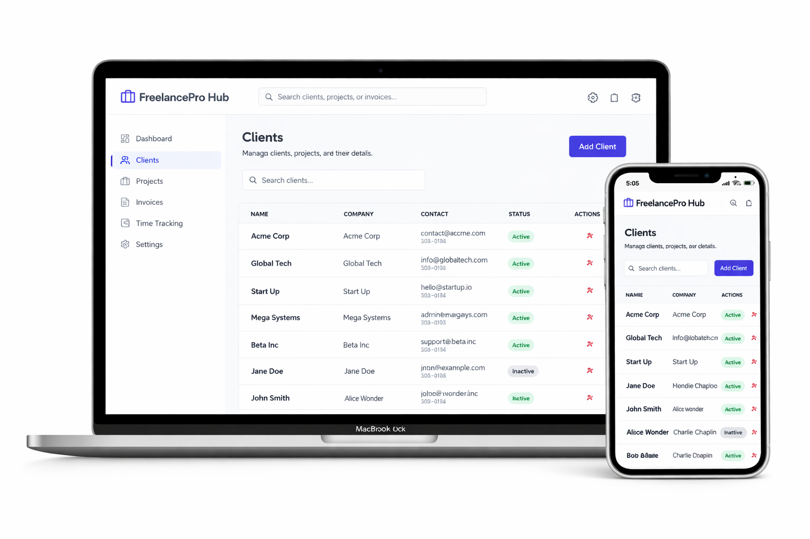

# FreelancePro Hub


A comprehensive business management dashboard for freelancers. Manage clients, projects, invoices, time tracking, and settings – all with static mock data and a beautiful, responsive UI.

## 🚀 Live Demo
[https://freelancer-pro-hub-two.vercel.app/](https://freelancer-pro-hub-two.vercel.app/)

## ✨ Features
- Dashboard – KPI cards, earnings chart, activity feed
- Client Management – Searchable table, add/edit/delete clients, detail panel
- Project Tracking – Card grid with progress bars, task checklists, time entries
- Invoicing – Create invoices, status badges, summary
- Time Tracking – Start/stop timer, logged entries
- Settings – Profile form, notification toggles, dark/light mode
- Collapsible Sidebar – Icon-based navigation
- Fully Responsive – Mobile, tablet, desktop
- Accessible – Skip to content, semantic HTML, ARIA labels

## 🛠 Tech Stack
- Framework: Next.js 14 (App Router)
- Language: TypeScript
- Styling: Tailwind CSS
- Charts: react-chartjs-2, Chart.js
- Icons: lucide-react
- Deployment: Vercel
  

## 📁 Project Structure


Freelancer-pro-hub/

├── src/

│   ├── components/               # Reusable components

│   │   ├── ui/                   # Base UI components

│   │   │   ├── button.tsx        # Styled button component

│   │   │   ├── card.tsx          # Card container component

│   │   │   ├── input.tsx         # Form input component

│   │   │   ├── modal.tsx         # Modal dialog component

│   │   │   └── skeleton.tsx      # Loading skeleton component

│   │   ├── charts/               # Chart components

│   │   │   ├── MonthlyEarningsChart.tsx  # Line chart for earnings

│   │   │   └── WeeklyHoursChart.tsx      # Bar chart for hours

│   │   ├── dashboard/            # Dashboard-specific components

│   │   │   ├── StatsDisplay.tsx  # KPI cards display

│   │   │   └── RecentActivity.tsx # Activity feed

│   │   ├── Header.tsx            # Top navigation header

│   │   ├── Layout.tsx            # Main layout wrapper

│   │   └── Sidebar.tsx           # Navigation sidebar

│   ├── pages/                    # Page components

│   │   ├── Dashboard.tsx         # Main dashboard view

│   │   ├── Clients.tsx           # Client management page

│   │   ├── Projects.tsx          # Project tracking page

│   │   ├── Invoices.tsx          # Invoice management page

│   │   ├── TimeTracking.tsx      # Time tracking page

│   │   └── Settings.tsx          # Settings/profile page

│   ├── contexts/                 # React Context providers

│   │   ├── ThemeContext.tsx      # Dark/light mode context

│   │   ├── ToastContext.tsx      # Toast notification context

│   │   └── DataStoreContext.tsx  # Global data management context

│   ├── lib/                      # Utility functions & helpers

│   │   ├── mockData.ts           # Static mock data for all features

│   │   ├── csvUtils.ts           # CSV export utilities

│   │   ├── pdfUtils.ts           # PDF export utilities

│   │   └── utils.ts              # General utility functions

│   ├── App.tsx                   # Main app component

│   ├── main.tsx                  # Application entry point

│   └── index.css                 # Global styles

├── public/                       # Static assets

├── .env.example                  # Environment variables template

├── index.html                    # HTML entry point

├── package.json                  # Dependencies & scripts

├── tsconfig.json                 # TypeScript configuration

├── vite.config.ts                # Vite configuration

└── metadata.json                 # Project metadata


📸 Screenshot




## 🚦 Getting Started
```bash
git clone https://github.com/birukdev12-senior/freelancepro-hub.git
cd freelancepro-hub
npm install
npm run dev

Open http://localhost:3000.

📜 License

MIT License.

```
